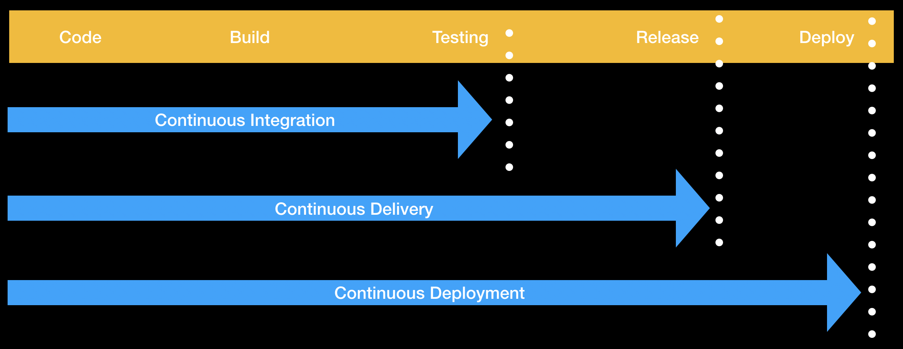

# Azure Kubernetes Services (AKS) - Infrastructure as Code

This work aims to explore ways to automate Continuous Delivery and Continuous Deployment of applications in the context of Microsoft Azure Kubernetes Services (AKS).

---

## CI/CD Pipeline

---

## Git Branches Definition

Each Git branch represents a Azure deployment environment (DEV, STG, PRD).

---

## Workflow

(**PR**) => [**development**] => (**rebase-ff**) => [**staging**] => (**rebase-ff**) => [**production**]

- Create PR into **development** branch
- Attach issue to the PR
- Push changes into **issue** branch
- Confirm successful deployment of **development** environment
- Merge PR into **development** branch
- Rebase (Fast-Forward) **staging** on top of **development** branch
- Push changes into **staging** branch
- Confirm successful deployment of **staging** environment
- Rebase (Fast-Forward) **production** on top of **staging** branch
- Push changes into **staging** branch
- Confirm successful deployment of **production** environment

---

## Azure Deployment Environments

| Deployment Target | Uptime         | Purpose                        |
| ----------------- | -------------- | ------------------------------ |
| **development**   | 50% or less    | add & test new features        |
| **staging**       | 90% or more    | test integration & performance |
| **production**    | 99.99% or more | run production                 |
